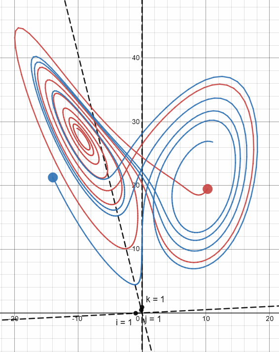
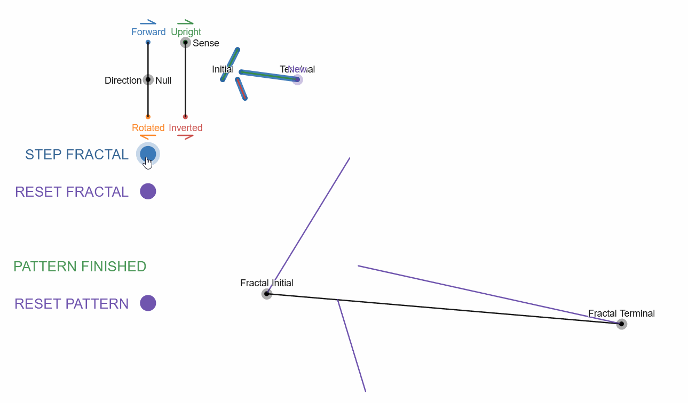
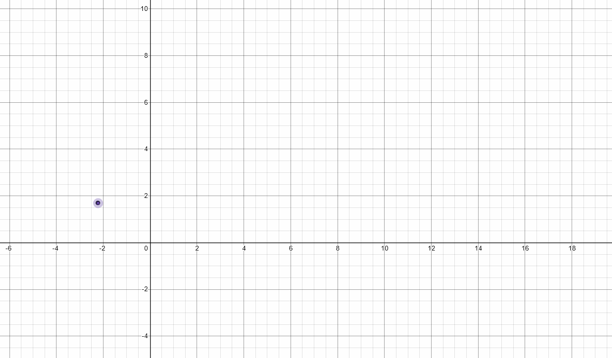
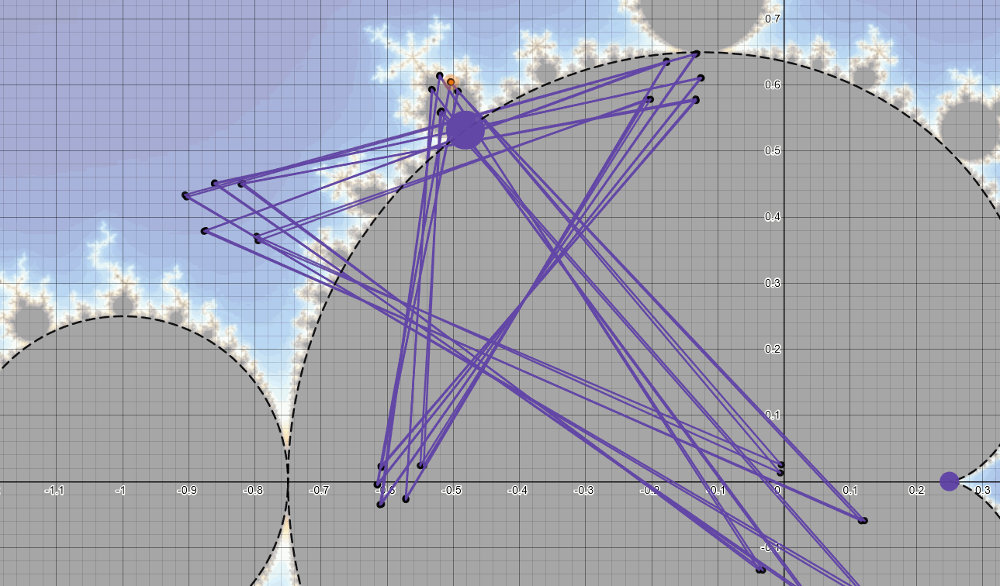
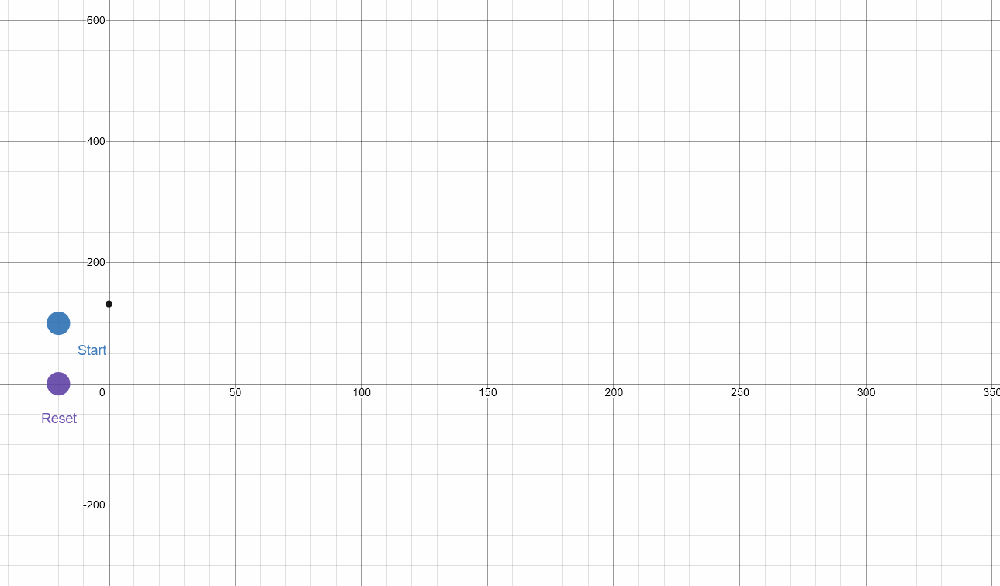
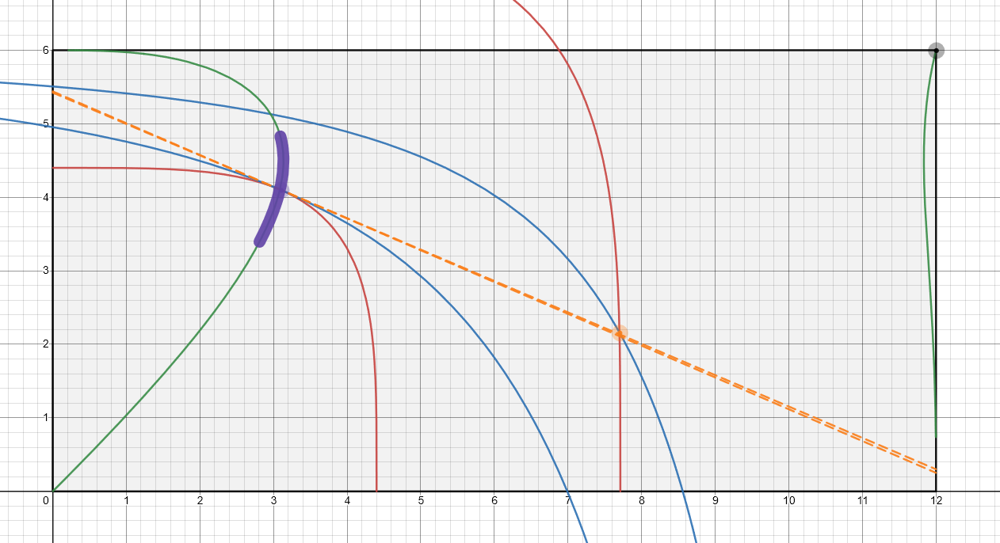
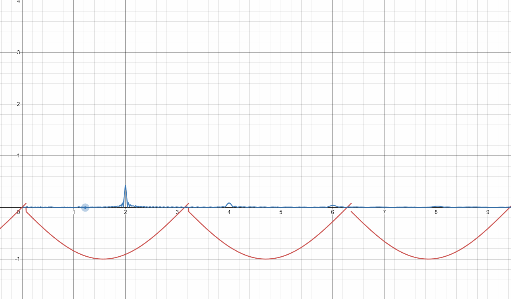
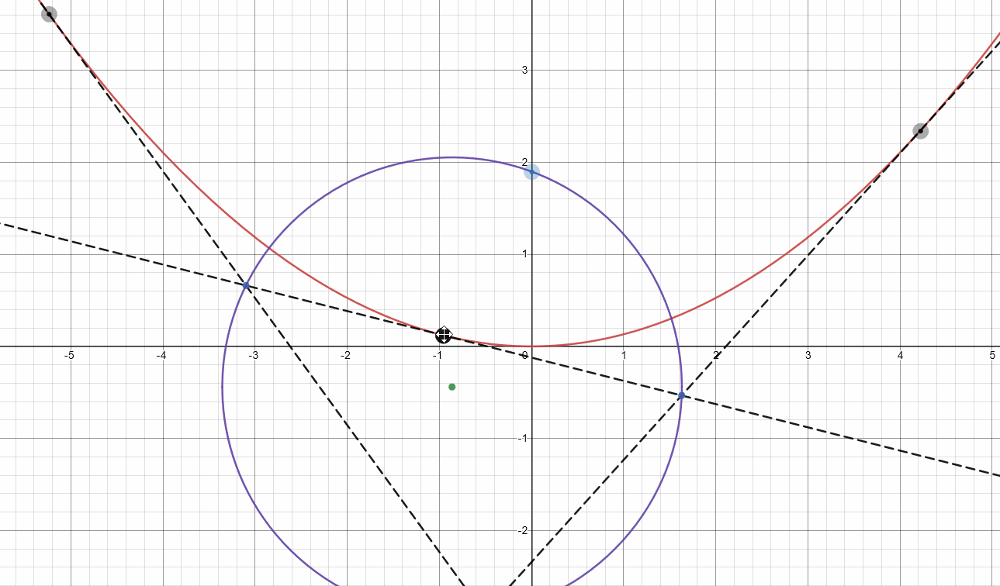

# desmos-graph-samples
My examples of cool interactive maths with the online Desmos Grapher
Maybe a guide on practicala use of Desmos actions will come later.

The Lorenz Attractor in 3D - https://www.desmos.com/calculator/qnlbav9asr

Graphing all sorts of objects in 3D - https://www.desmos.com/calculator/799tfd4lh4

Koch substitution fractals - https://www.desmos.com/calculator/xlncdm5i13

Runge-Kutta Differential Equation Solving - https://www.desmos.com/calculator/w4wqc2nvaf

Explore the periods of Mandelbrot Set orbits - https://www.desmos.com/calculator/gvb2oweuxb

The Collatz Conjecture tester - https://www.desmos.com/calculator/8ksudpq6si

Edgeworth Boxes modeling General Equilibrium in markets - https://www.desmos.com/calculator/p4km1kzqgb

Slow Fourier Transform - https://www.desmos.com/calculator/ml32uned2s

Lambert's Parabola Theorem - https://www.desmos.com/calculator/p2mw7z4hrz

